  

  
  
  

---

### 👩‍💻 About me

I build backend-first web applications: RESTful APIs, relational data models and clean, maintainable architectures.

- 🏗️ I work with **Clean Architecture, MVC, MVVM and layered architecture** in .NET, Laravel, Spring Boot and Node.js
- 🤝 Experienced in team projects under **Scrum**, with code reviews through Pull Requests, technical documentation and API testing
- 🎯 Currently looking for my **first role as a Junior Full Stack Developer**
- 🌎 Based in Costa Rica · Spanish (native) · English (B2)
- 📄 Download my CV: [Spanish](https://github.com/Abigail140605/Abigail140605/raw/main/cv/Abigail__CV_ES.pdf) · [English](https://github.com/Abigail140605/Abigail140605/raw/main/cv/Abigail_CV_EN.pdf)

---

### 🛠️ Tech stack

**Backend**

  

**Frontend**

  

**Databases & DevOps**

  

